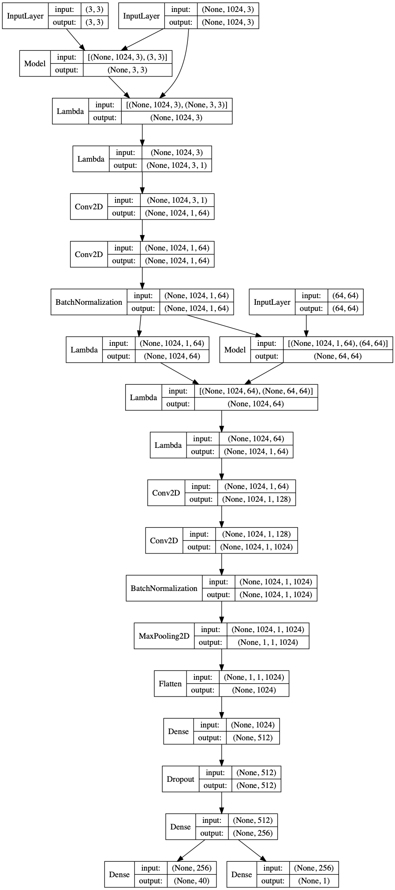
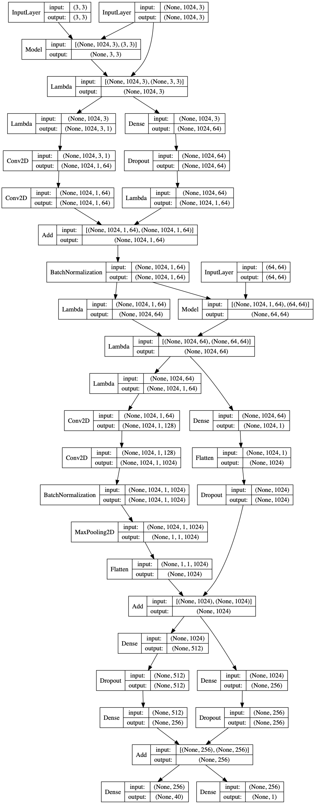
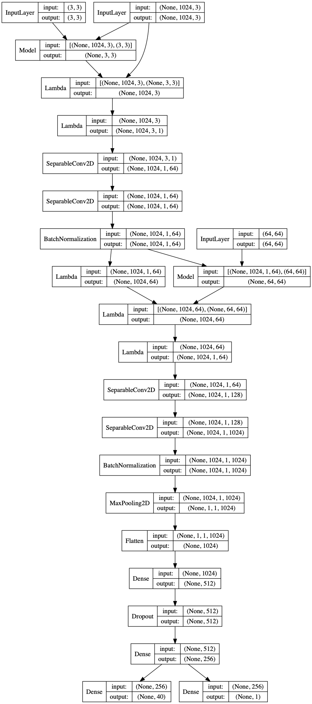

# pointnet-implementation

### pointnet implementation with Keras and PyTorch

**This is a school project.**

This achieves similar slightly worse result to the original paper and github project.

With the addition of an acgan model. 

Also, I built a `Separable` model, and a `Residual` version. For detailed comparison with the original [PointNet][p-net], please go to my other repo [On-3D-Classification][3d repo] for the `README.md` there.

`PointNet`:

`Residual` Network:

`Separable` Netword:

`Separable_Residual` Network:
~[Both](Keras/Separable_Residual_Classifier.png)

[3d repo]: https://github.com/MutatedFlood/On-3D-classification

[p-net]: https://github.com/charlesq34/pointnet 